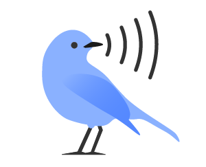

# MissedNet: Audio Analysis Tool

A PyQt5-based desktop application for analyzing and verifying bird audio detections from acoustic monitoring data.



## Features

- **Audio Detection Review**: Listen to and verify bird species detections from acoustic recordings
- **Flexible Time Periods**: Analyze data by day, week, or month
- **Smart Behavior Lists**: Implement blacklists, whitelists, and graylists for species management
- **Spectrogram Visualization**: View audio spectrograms for each detection
- **Export Functionality**: Export verified (or uncertain!) clips with timestamps
- **Progress Tracking**: Resume analysis from the most recent finished period
- **Keyboard Shortcuts**: Navigate efficiently with arrow keys and hotkeys

## Installation

### Prerequisites

- Python 3.7 - 3.12
- Required Python packages (install via pip):

```bash
pip install pandas librosa sounddevice soundfile matplotlib numpy PyQt5
```

### Setup

1. Clone this repository:
```bash
git clone https://github.com/abbycperkins/MissedNet.git
cd missednet
```

2. Ensure you have the required image assets:
   - `logo.png` - Application logo
   - `window_icon.png` - Window icon
   - `volume.png` - Volume control icon

3. Run the application:
```bash
python audio_analysis.py
```

## Usage

### Directory Structure

Your analysis directory should contain:
```
project_folder/
├── Data/           # Audio files (.wav)
├── Selections/     # Detection files (.txt/.csv)
├── results.csv     # Output results (created automatically)
└── behavior_dict.csv # Behavior settings (created automatically)
```

### Getting Started

1. **Launch Application**: Run the Python script
2. **Select Timeframe**: Choose Day, Week, or Month analysis
3. **Choose Directory**: Select your project folder containing Data and Selections subdirectories
4. **Review Detections**: Listen to each detection and classify as:
   - ✅ **Good Identification**: Confirmed species presence
   - ❌ **Not Confirmed**: Failed verification

### Keyboard Shortcuts

- **←/→ Arrow Keys**: Navigate between detections
- **Enter**: Mark as "Good Identification"
- **Backspace**: Mark as "Not Confirmed"

### Advanced Options

Access the **Advanced Options** panel to set species behavior:

- **Default**: Check every detection period
- **Blacklist**: Assume species never present (skip all detections)
- **Graylist**: Reduce to weekly checks after confirmation
- **Whitelist**: Assume species always present (skip verification)

## File Formats

### Input Files

**Audio Files** (in `Data/` folder):
- Format: `.wav`
- Naming convention: `ID_YYYYMMDD_HHMMSS.wav`

**Selection Files** (in `Selections/` folder):
- Format: Tab-delimited text files
- Required columns:
  - `Label` or `Common Name`: Species name
  - `Score` or `Confidence`: Detection confidence
  - `Begin Time (s)`: Start time in seconds
  - `End Time (s)`: End time in seconds
  - `File`: Associated audio file name

### Output Files

**results.csv**: Analysis results with columns:
- `Date`: Analysis period
- `Complete`: Period completion status
- `[Species Names]`: Detection results for each species

**behavior_dict.csv**: Species behavior settings

**Exported_Clips/**: Directory containing exported audio clips

## Features in Detail

### Spectrogram Display
- Real-time spectrogram generation using librosa
- Linear frequency scale with time axis
- Grayscale colormap for clear visualization

### Audio Playback
- Adjustable volume control
- Threaded playback to prevent UI freezing
- Automatic replay functionality

### Export Clips
- Export individual detections as timestamped WAV files
- Filename format: `YYYY-MM-DD_HH-MM-SS_Species_Name.wav`
- Preserves original audio quality

### Web Integration
- Quick access to All About Birds sound examples
- Automatic species name formatting for URLs

## License

This project is licensed under the MIT License - see the [LICENSE](LICENSE) file for details.

## Acknowledgments

- Built with PyQt5 for the user interface
- Audio processing powered by librosa
- Spectrogram visualization using matplotlib
- Audio playback via sounddevice

## Citation

If you use MissedNet in your research, please cite:

```
[IN PROGRESS]
```

## Support

For questions, issues, or feature requests, please:
- Open an issue on GitHub
- Contact: [abbyperkins@ku.edu]
